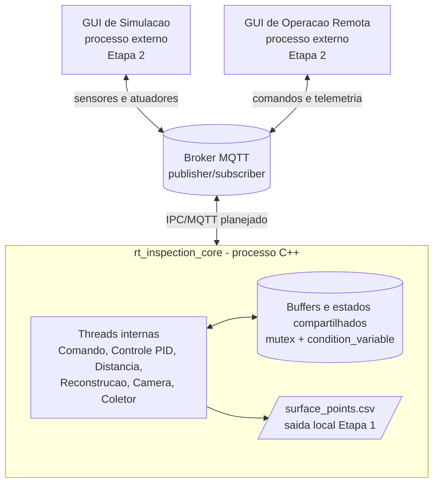
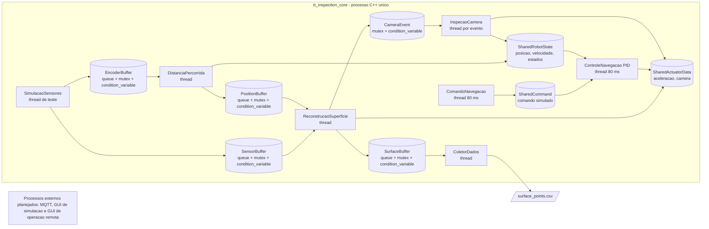

# Arquitetura proposta do projeto

Este diagrama registra a arquitetura completa proposta para o projeto. Na Etapa 1 foi implementado o núcleo C++ com threads e buffers internos. Na Etapa 2, os processos externos de simulação, operação remota e broker MQTT devem ser integrados ao núcleo.

## Detalhamento do núcleo implementado na Etapa 1

Legenda:

- Retangulos: tarefas implementadas como threads C++.
- Cilindros: buffers ou estados compartilhados em memoria.
- Setas: fluxo de dados ou sinalizacao entre tarefas.
- `SensorBuffer`, `EncoderBuffer`, `PositionBuffer` e `SurfaceBuffer`: padrao produtor-consumidor.
- `CameraEvent`: evento disparado quando a reconstrucao detecta falha.
