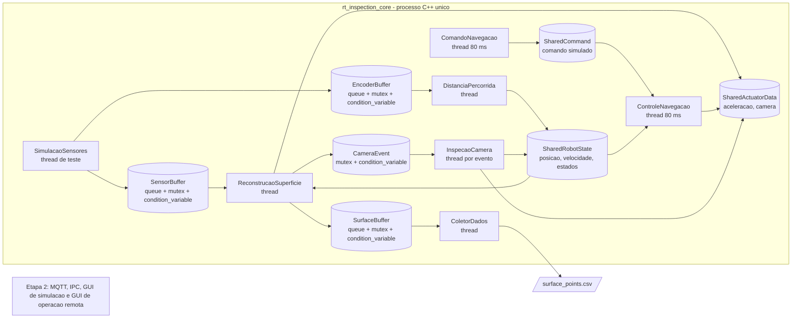

# Arquitetura da Etapa 1

Este diagrama em Mermaid pode ser usado como base para a figura do relatorio.

Legenda:

- Retangulos: tarefas implementadas como threads C++.
- Cilindros: buffers ou estados compartilhados em memoria.
- Setas: fluxo de dados ou sinalizacao entre tarefas.
- `SensorBuffer`, `EncoderBuffer` e `SurfaceBuffer`: padrao produtor-consumidor.
- `CameraEvent`: evento disparado quando a reconstrucao detecta falha.
